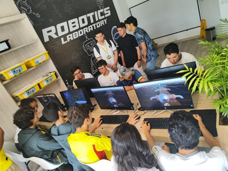

# Videojuego - Electrum Travel

---

**Electrum Travel** es un videojuego educativo desarrollado en **Unity** con programación en **C#**, diseñado para la **exploración interactiva** y la **resolución de minijuegos**.  
Su objetivo principal es enseñar y reforzar **conceptos de electrónica** de una manera **dinámica, lúdica e interactiva**, acercando a los estudiantes a esta área del conocimiento de forma más atractiva que los métodos tradicionales. El proyecto combina **diseño 3D**, **programación de lógica de juego** y **narrativa educativa**, mostrando cómo la tecnología puede aplicarse en contextos **creativos, pedagógicos y de divulgación científica**.  

Este repositorio contiene el **código fuente principal, escenas y configuraciones** necesarias para ejecutar y comprender la lógica del proyecto.

---

## Descripción

El jugador toma el rol de un **hacker** que recibe la misión de infiltrarse en el **Museo de Electrónica** para detener un virus cibernético.  
Durante la experiencia debe:

- Explorar las salas del museo e interactuar con objetos y audios informativos.  
- Resolver **minijuegos educativos** relacionados con áreas de la ingeniería.  
- Superar un **juego final de telecomunicaciones** para completar la misión.  

---

## Minijuegos principales

1. **PCB Electrónica** → organizar componentes en una tarjeta.  
2. **Levitador Neumático** → control de estabilidad con un ventilador.  
3. **Seguidor de Línea** → guiar un robot evitando obstáculos.  
4. **Robot Digital** → esquivar virus en un canal de datos.  
5. **Juego Final: Antena y Satélite** → orientar correctamente la antena para restablecer la conexión.  

---

## Rol 
Como desarrollador principal del proyecto, mis aportes incluyen:

- Diseño y programación de la **lógica del juego** en C#.  
- Creación de **escenas jugables** y cinemáticas en Unity.  
- Integración y modelado 3D creados en **Blender** de la casa, museo y demas escenarios.  
- Optimización de recursos para su ejecución en tiempo real.  
- Gestión de versiones y organización del proyecto en GitHub.  

Este proyecto refleja mis capacidades tanto en **programación** como en **gestión de recursos digitales pesados** para videojuegos.

---

## Contenido del repositorio
## Contenido del repositorio

- **`Build_Videojuego/Electrum Travel.exe`** — Ejecutable del videojuego (demo para Windows).
- **`Documentos/Certificado_Diplomado.pdf`** — Certificación del diplomado.
- **`Documentos/DOCUMENTACION -FINAL.pdf`** — Informe general del proyecto.
- **`Documentos/Presentación Electrum Travel.pdf`** — Presentación del videojuego.
- **`Personajes/`** — Assets y archivos fuente de personajes.
- **`Recursos/`** — Imágenes y GIFs usados en el README y material de difusión.
- **`Unity/Assets/Scripts`** — Código en C# que gestiona la lógica del juego.
- **`Unity/Assets/Scenes`** — Escenas principales del videojuego.
- **`Unity/Assets/Prefabs`** — Prefabs ligeros para pruebas (los pesados están en Drive).
- **`Unity/Assets/Terrenos`** — Terrenos y configuraciones de entorno.
- **`Unity/Assets/Settings`** — Configuraciones del proyecto/renderer.
- **`Unity/Packages`** — Dependencias y paquetes del proyecto.
- **`Unity/ProjectSettings`** — Configuración general de Unity.

> Nota: Los recursos pesados (modelos 3D complejos, prefabs grandes, texturas HD y cinemáticas) no se encuentran aquí debido a las restricciones de tamaño de GitHub.

---

## Recursos pesados
Los siguientes elementos del proyecto se encuentran almacenados en **Google Drive**:

- **Diseños Blender** → Modelos 3D originales.  
- **Prefabs pesados** → Modelos y assets que superan los 50 MB.  
- **Gameplay.mp4** → Video de demostración del juego.  
- **Assets (Otros)** → Carpeta con materiales y elementos que no pudieron ser subidos por tamaño.  

[Acceso a recursos en Google Drive](https://drive.google.com/drive/folders/127Xel7jZL63xM-Dr2iKFpTcULgsekJCU?usp=sharing)

---

## Demostración
Vista previa del juego en acción:

---

---

---

## Tecnologías utilizadas
- **Unity** (motor de juego principal)  
- **C#** (programación de la lógica del juego)  
- **Blender** (diseño y modelado 3D)  
- **.NET SDK y Rider** (desarrollo y compilación)

---

## Puesta en escena

El videojuego *Electrum Travel* fue presentado en diferentes instituciones educativas como herramienta de divulgación para que estudiantes de colegio conocieran de manera interactiva aspectos de la **Ingeniería Electrónica** y las oportunidades que ofrece la universidad.  

Durante estas sesiones:  
- Los estudiantes exploraron las mecánicas del juego y los minijuegos.  
- Se promovió el interés en áreas como la electrónica, la programación y el diseño 3D.  
- Se validó el proyecto como recurso pedagógico para apoyar procesos de orientación vocacional.  

---

## Cómo ejecutar el proyecto

1. Clonar este repositorio:
   - git clone https://github.com/Juanjo0812/Videojuego-ElectrumTravel.git

2. Abrir el proyecto en Unity Hub.

3. Cargar la escena principal en Assets/Scenes/.

4. Ejecutar el juego desde el editor.

5. Para acceder a todos los modelos y recursos, descargar la carpeta de Google Drive.

## Autores

- **Juan Joseph Mora** – Desarrollador principal (programación en C#, integración en Unity, diseño de escenas y gestión de recursos).  
- Andrés Felipe García – Modelado de algunos minijuegos y apoyo en diseño.  
- Harold Mauricio Gómez – Documentación y pruebas.  
- Diego Alexander Ramírez – Diseño de personajes y assets.  
- Andrés Mauricio Prieto – Presentación y apoyo en investigación.   

